### 01 &nbsp;Profile

I write software that talks to hardware, and I train models that have to run somewhere real.

Most of what I know comes from projects that broke first — flight controllers, custom PCBs, 3D-printed airframes, trading models, vision pipelines. School gave me the theory. The workbench gave me the rest.

<table>
<tr><td width="160"><b>School</b></td><td>IPSA Paris — aerospace engineering, 2nd year</td></tr>
<tr><td><b>Focus</b></td><td>Embedded software · applied ML · edge AI</td></tr>
<tr><td><b>Building since</b></td><td>Soldering at 8 · code at 13 · CAD at 15</td></tr>
<tr><td><b>Daily driver</b></td><td>Linux · i7 · RTX 3050 — writes his own GNOME Shell extensions</td></tr>
<tr><td><b>Also</b></td><td>Founder of <b>STAR Group</b>, a maker collective</td></tr>
<tr><td><b>Looking for</b></td><td>Internship — summer 2027 &nbsp;·&nbsp; Apprenticeship — 2027/2028</td></tr>
</table>

### 02 &nbsp;Selected work

<table>
<tr>
<td width="58%" valign="top">

#### AnimatAI
**Audio → facial blendshapes**

A model that drives 3D facial animation straight from a voice track, shipped with its own interface. Built the dataset, trained the network, wrote the UI.

<a href="https://github.com/starman-tech/AnimatAI"><b>Repository →</b></a>

</td>
<td width="42%" valign="top"></td>
</tr>

<tr>
<td width="58%" valign="top">

#### Solar glider &nbsp;<i>in progress</i>
**Long-endurance flight on solar power**

Airframe, electronics and flight software all built in-house. The hard part isn't the flying, it's the energy budget.

</td>
<td width="42%" valign="top"></td>
</tr>

<tr>
<td width="58%" valign="top">

#### FocusPCSI
**A focus timer that catches you**

Runs entirely in the browser — no server, no account, nothing leaving your machine. Detects when you pick up your phone. Neo-brutalist UI.

<a href="https://github.com/starman-tech/FocusPCSI"><b>Repository →</b></a>

</td>
<td width="42%" valign="top"></td>
</tr>
</table>

<b>&nbsp;Other repositories</b>

 

### 03 &nbsp;Toolbox

<table>
<tr>
<td width="150" valign="middle"><b>Embedded</b></td>
<td width="170" valign="middle"></td>
<td valign="middle">STM32 · Arduino Nano/Uno · Raspberry Pi SPI · I²C · UART · PWM · interrupts · timers · embedded Linux</td>
</tr>
<tr>
<td valign="middle"><b>Machine learning</b></td>
<td valign="middle"></td>
<td valign="middle">PyTorch · scikit-learn · XGBoost · pandas Computer vision · time series · LLM fine-tuning · custom datasets</td>
</tr>
<tr>
<td valign="middle"><b>Software</b></td>
<td valign="middle"></td>
<td valign="middle">Python · C++ · Rust · JavaScript · HTML/CSS Web apps · scrapers · automation · GNOME Shell extensions</td>
</tr>
<tr>
<td valign="middle"><b>Hardware & CAD</b></td>
<td valign="middle"></td>
<td valign="middle">KiCad · Fusion 360 · FreeCAD · CATIA · SolidWorks Schematic to routed PCB · 3D printing · laser cutting</td>
</tr>
<tr>
<td valign="middle"><b>Tooling</b></td>
<td valign="middle"></td>
<td valign="middle">Linux · Git · GitHub Actions · Docker CI pipelines, automated builds and releases</td>
</tr>
</table>

### 04 &nbsp;The lab

 

<table>
<tr>
<td width="33%" valign="top"><b>Fabrication</b>  Wanhao Duplicator 12 — dual extruder Soldering station — THT &amp; SMD Laser cutting (off-site)</td>
<td width="33%" valign="top"><b>Compute</b>  Linux daily driver — i7 · RTX 3050 Dual-boot, but always on Linux Custom GNOME Shell extensions</td>
<td width="33%" valign="top"><b>Flight</b>  FPV quads Flying wings Gliders — incl. the solar build</td>
</tr>
</table>

### 05 &nbsp;Activity

<picture>
  <source media="(prefers-color-scheme: dark)" srcset="https://raw.githubusercontent.com/starman-tech/starman-tech/output/snake-dark.svg">
  <source media="(prefers-color-scheme: light)" srcset="https://raw.githubusercontent.com/starman-tech/starman-tech/output/snake-light.svg">
  
</picture>

  

### 06 &nbsp;STAR Group

A maker collective I founded — a place to build ambitious projects with people who'd rather ship than talk about shipping. Currently in development.

<b>&nbsp;Version française</b>

 

#### Profil

J'écris du logiciel qui parle à du matériel, et j'entraîne des modèles qui doivent tourner quelque part de réel.

L'essentiel de ce que je sais vient de projets qui ont d'abord cassé — contrôleurs de vol, PCB maison, cellules imprimées en 3D, modèles de trading, pipelines de vision. L'école m'a donné la théorie, l'établi a fait le reste.

| | |
|:---|:---|
| **École** | IPSA Paris — 2ᵉ année |
| **Domaines** | Logiciel embarqué · ML appliqué · edge AI |
| **Depuis** | Soudure à 8 ans · code à 13 ans · CAO à 15 ans |
| **Recherche** | Stage été 2027 · alternance 2027/2028 |

#### Compétences

| Domaine | Détail |
|:---|:---|
| **Embarqué** | STM32, Arduino, Raspberry Pi · SPI, I²C, UART, PWM, interruptions · C++ bare-metal · Linux embarqué |
| **Machine learning** | PyTorch, scikit-learn, XGBoost · vision, séries temporelles, fine-tuning de LLM, audio → blendshapes · datasets constitués à la main |
| **Logiciel** | Python, C++, Rust, JavaScript · scrapers, automatisation, extensions GNOME Shell |
| **Matériel & CAO** | KiCad du schéma au PCB routé · Fusion 360, FreeCAD, CATIA · impression 3D |

#### Le lab

Wanhao Duplicator 12 (double extrudeur), station de soudure, découpe laser en externe. PC sous Linux au quotidien (i7, RTX 3050). Quads FPV, ailes volantes, planeurs — dont un planeur solaire en cours.

#### STAR Group

Un collectif de makers que j'ai fondé — un endroit pour construire des projets ambitieux avec des gens qui préfèrent livrer que d'en parler. En cours de développement.

### Let's build something

&nbsp;

